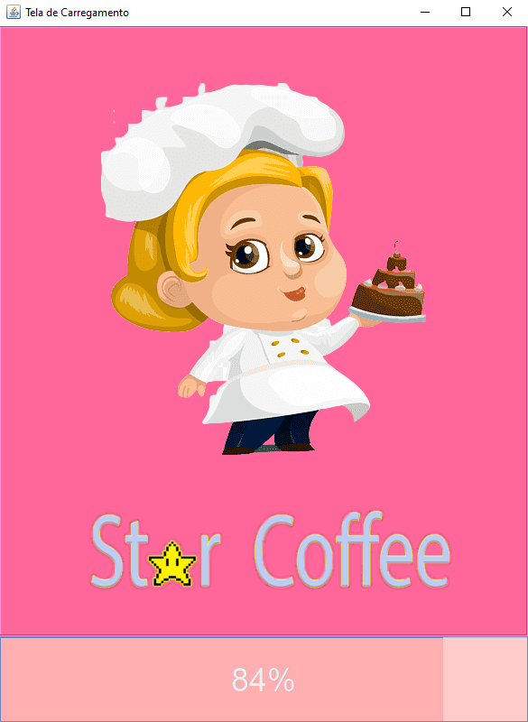
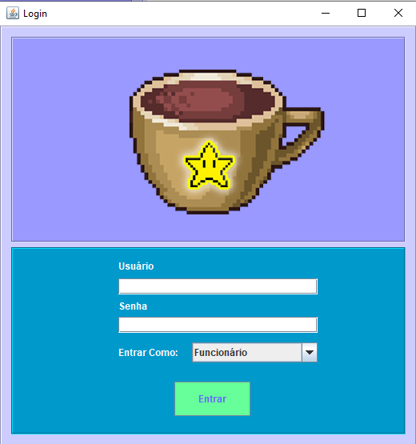

# __Fábrica de Projetos II__

## __Sistema Para Gerenciamento de Cafeteria__

O Sistema possui o intuito de possibilitar o cadastro de clientes e produtos, bem como permitir a utilização de mecanismos de vendas para melhorar os serviços da empresa.  

## __Ferramentas e Linguagens utilizadas__

### **Java (v8.2)**  

Java é uma linguagem de programação orientada a objetos desenvolvida na década de 90 por uma equipe de programadores chefiada por James Gosling, na empresa Sun Microsystems. Em 2008 o Java foi adquirido pela empresa Oracle Corporation. A linguagem foi utilizada neste projeto para a criação das telas, funcionalidades e implementação do banco de dados.  

### **MySQL (v8.0)**  

O MySQL é um sistema de gerenciamento de banco de dados, que utiliza a linguagem SQL como interface. É atualmente um dos sistemas de gerenciamento de bancos de dados mais populares da Oracle Corporation, com mais de 10 milhões de instalações pelo mundo. Neste projeto, o MySQL foi utilizado para a criação da base de dados do sistema (tabelas, atributos, etc), bem como para a implementação das funções de cadastro de clientes e produtos.

### **Netbeans (IDE)**  

O NetBeans IDE é um ambiente de desenvolvimento integrado gratuito e de código aberto para desenvolvedores de software nas linguagens Java, JavaScript, HTML5, PHP, C/C++, Groovy, Ruby, entre outras. O IDE é executado em muitas plataformas, como Windows, Linux, Solaris e MacOS. Neste projeto, a IDE foi utilizada principalmente na criação das telas (JFrames) e estruturação da programação orientada a objetos, com a criação de classes e métodos.

### **MySQL Workbench (SGBD)**  

O MySQL Workbench é uma ferramenta visual de design de banco de dados que integra desenvolvimento, administração, design, criação e manutenção de SQL em um único ambiente de desenvolvimento integrado para o sistema de banco de dados MySQL. Neste projeto, o SGBD foi utilizado para visualização dos dados e realização de consultas.

## __Digrama de Entidades e Relacionamentos (DER)__

O diagrama acima mostra a estrutura de entidades e relacionamentos do sistema. Foi criado com o auxílio da ferramenta <a href="https://creately.com/">creately</a>, que permite a criação de diagramas de entidades e relacionamentos.

## __Diagrama de Classes__

## __Telas do Sistema__

### **Tela Carregamento**  

### **Tela de Login**

### **Tela do Menu**

